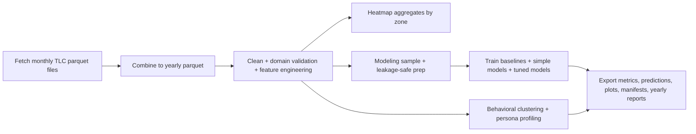
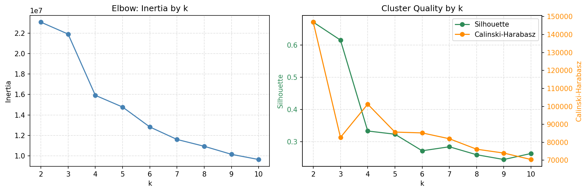
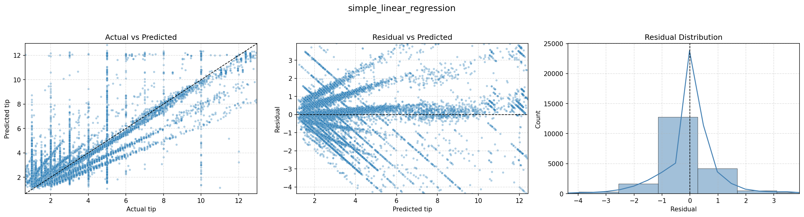
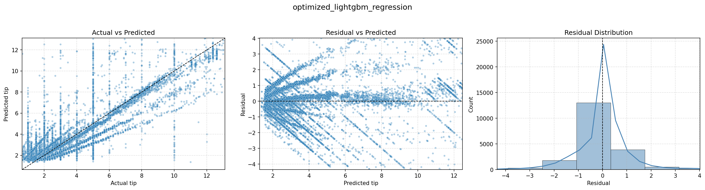

# NYC Yellow Taxi Tip Optimization (2015-2022)

End-to-end data science pipeline for analyzing NYC TLC yellow taxi trips and identifying trip patterns associated with stronger tipping outcomes.

[](#environment) [](#data-scope-and-scale) [](#modeling-design) [](#behavioral-clustering-design) [](#artifact-layout)

## Table of Contents
- [Executive Summary](#executive-summary)
- [Project Objective](#project-objective)
- [Quick Start](#quick-start)
- [Key Files Index](#key-files-index)
- [Data Sources](#data-sources)
- [Data Scope and Scale](#data-scope-and-scale)
- [End-to-End Pipeline](#end-to-end-pipeline)
- [Repository Workflow](#repository-workflow)
- [Interactive Heatmap](#interactive-heatmap)
- [Modeling Design](#modeling-design)
- [Results at a Glance (2015-2022)](#results-at-a-glance-2015-2022)
- [Recurring Feature Signals](#recurring-feature-signals)
- [Behavioral Clustering Design](#behavioral-clustering-design)
- [2015 Cluster Personas (5M Sample)](#2015-cluster-personas-5m-sample)
- [Temporal Clustering Insights (2015 vs 2020 vs 2022)](#temporal-clustering-insights-2015-vs-2020-vs-2022)
- [Example Diagnostic Plots](#example-diagnostic-plots)
- [Artifact Layout](#artifact-layout)
- [Environment](#environment)
- [Practical Limitations](#practical-limitations)
- [Next Planned Extension](#next-planned-extension)

## Executive Summary
This project builds a reproducible analytics and modeling pipeline to answer a practical operations question: How can NYC yellow taxi drivers identify trips and contexts associated with stronger tipping outcomes.

### Portfolio Snapshot
| Dimension | Summary |
|---|---|
| Business focus | Driver-facing tip optimization guidance from observational trip data |
| Time window | 2015-2022 NYC yellow taxi trips |
| Data scale | 673.4M combined rows, 434.3M cleaned rows |
| Modeling scope | Interpretable + optimized supervised models and unsupervised behavioral clustering |
| Key outputs | Yearly model reports, cluster personas, diagnostics, coefficients/importances, prediction exports, interactive zone heatmap |

### Key Outcomes
- Built a full ingestion-to-reporting workflow with deterministic sampling and explicit leakage controls
- Produced consistent year-over-year model gains over naive baselines
- Identified stable predictive drivers across years, including airport context, fare/tolls, and temporal-location patterns
- Packaged outputs into review-ready artifacts (`model_outputs/year_YYYY/`) suitable for technical and non-technical audiences

### Why This Matters
- For operations: supports decision guidance on trip context prioritization and tipping probability
- For analytics teams: demonstrates production-style data lineage, robust cleaning logic, and reproducible experimentation
- For recruiters: showcases end-to-end ownership across data engineering, feature design, modeling, diagnostics, and reporting

## Project Objective
Build reliable, explainable models and visuals that help answer:

- What trip conditions are associated with higher `tip_amount`
- What trip contexts increase/decrease the probability that a rider tips at all
- Which patterns are stable across years versus year-specific

This repository is designed for analysis rigor and reproducibility.

> [!IMPORTANT]
> This repo does **not** include raw or cleaned trip parquet files in version control because of size.  
> To reproduce results, run the local ingestion and cleaning pipeline on your machine.

## Quick Start
### Full Rebuild (Raw TLC Files -> Final Artifacts)

```bash
pip install duckdb pyarrow pandas numpy scipy seaborn matplotlib scikit-learn lightgbm optuna geopandas shapely folium branca requests
python parquet_fetch.py
python parquet_combine.py
python parquet_clean.py
python heatmap_clean.py
python interactive_heatmap.py
python tip_modeling.py
python behavioral_clustering.py
```

### Analysis-Only Rerun (Cleaned Parquet Already Exists)

```bash
python heatmap_clean.py
python interactive_heatmap.py
python tip_modeling.py
python behavioral_clustering.py
```

Notes:

- The default `behavioral_clustering.py` `__main__` block runs one year; use the exported functions for multi-year runs
- Full end-to-end generation is compute and disk intensive; see the scale section below before running

## Key Files Index
| File | Role | Main Inputs | Main Outputs |
|---|---|---|---|
| `parquet_fetch.py` | Pull monthly TLC parquet files to local cache | TLC cloudfront monthly parquet URLs | `taxi_parquet_cache/<year>/*.parquet` |
| `parquet_combine.py` | Combine monthly files into year-level parquet | `taxi_parquet_cache` monthly files | `taxi_parquets/yellow_year_<year>.parquet` |
| `parquet_clean.py` | Domain cleaning + feature engineering + fare validation | `taxi_parquets/yellow_year_<year>.parquet` | `taxi_parquets/yellow_clean_<year>.parquet` |
| `heatmap_clean.py` | Build zone-level tip aggregates | `taxi_parquets/yellow_clean_<year>.parquet` | `heatmaps/heat_<year>.csv` |
| `interactive_heatmap.py` | Render interactive tip map | heatmap CSVs + taxi zones | `tips_map_slim.html` |
| `tip_modeling.py` | Supervised modeling, tuning, diagnostics, and year reports | `taxi_parquets/yellow_clean_<year>.parquet` | `model_outputs/year_<year>/...` |
| `behavioral_clustering.py` | Behavioral segmentation + persona reporting | `taxi_parquets/yellow_clean_<year>.parquet` | `cluster_outputs/year_<year>/...` |

## Data Sources
- NYC TLC Trip Record Data (official portal): https://www.nyc.gov/site/tlc/about/tlc-trip-record-data.page
- Monthly yellow taxi parquet endpoint (used by the fetch script):  
  `https://d37ci6vzurychx.cloudfront.net/trip-data/yellow_tripdata_YYYY-MM.parquet`
- Taxi zone lookup and shapes (from TLC trip data portal resources), converted locally to `taxi_zones_4326.parquet` and already provided for use
- Fare and surcharge reference used for meter validation logic: https://www.nyc.gov/site/tlc/passengers/taxi-fare.page
- 2022 fare-rule change reference: https://rules.cityofnewyork.us/rule/taximeter-rate-of-fare-and-various-surcharges/

## Data Scope and Scale
Current local run footprint in this repository:

- Combined yearly trips (2015-2022): **673,350,692** rows (`yellow_year_*.parquet`)
- Cleaned modeling-ready trips (2015-2022): **434,333,423** rows (`yellow_clean_*.parquet`)
- Net retention after cleaning: **64.50%**

### Combined vs Cleaned By Year
| Year | Combined Rows | Cleaned Rows | Retained |
|---|---:|---:|---:|
| 2015 | 146,039,231 | 87,413,584 | 59.86% |
| 2016 | 131,131,805 | 82,084,734 | 62.60% |
| 2017 | 113,500,327 | 72,533,965 | 63.91% |
| 2018 | 102,871,387 | 67,413,057 | 65.53% |
| 2019 | 84,598,444 | 58,003,719 | 68.56% |
| 2020 | 24,649,092 | 16,708,696 | 67.79% |
| 2021 | 30,904,308 | 21,490,950 | 69.54% |
| 2022 | 39,656,098 | 28,684,718 | 72.33% |

Approximate disk footprint in this workspace (these files will be generated):

- `taxi_parquet_cache` (2015-2022 monthly source files): ~9.63 GB
- `taxi_parquets/yellow_year_*.parquet`: ~9.69 GB
- `taxi_parquets/yellow_clean_*.parquet`: ~8.92 GB

Plan on **30+ GB free disk** for a full local run with artifacts.

## End-to-End Pipeline


## Repository Workflow
### 1) Fetch raw monthly data
Script: `parquet_fetch.py`

- Pulls monthly files from TLC cloudfront
- Uses retries/backoff and local cache checks
- Writes files to `taxi_parquet_cache/<year>/`

Run:

```bash
python parquet_fetch.py
```

Note: final loop in `parquet_fetch.py` controls years to fetch. Set it to `range(2015, 2023)` for full project coverage.

### 2) Combine monthly into yearly parquet
Script: `parquet_combine.py`

- Streams batches using PyArrow dataset API
- Enforces column schema consistency across years
- Produces `taxi_parquets/yellow_year_<year>.parquet`

Run:

```bash
python parquet_combine.py
```

### 3) Clean and feature-engineer yearly data
Script: `parquet_clean.py`

Key logic:

- Keeps card-paid trips (`payment_type=1`) for trustworthy tip labels
- Filters invalid values and impossible trips
- Adds temporal and trip context features
- Performs TLC meter-fare plausibility checks:
  - Handles standard metered logic
  - Handles JFK-Manhattan flat-rate logic both directions
  - Applies 2022-12-19 fare-rule cutover logic
  - Applies bounded surcharge/add-on caps for tolerance envelope
- Writes `taxi_parquets/yellow_clean_<year>.parquet`

Run:

```bash
python parquet_clean.py
```

### 4) Build zone-level heatmap datasets (optional)
Scripts:

- `heatmap_clean.py` -> creates `heatmaps/heat_<year>.csv`
- `interactive_heatmap.py` -> creates `tips_map_slim.html`

Run:

```bash
python heatmap_clean.py
python interactive_heatmap.py
```

## Interactive Heatmap
The project includes an interactive borough/zone tip-rate map built from cleaned yearly data and rendered with Folium for exploratory geographic storytelling.

- Hosted demo: https://davism1212.github.io/NYC-Yellow-Taxi-Analysis/


### 5) Modeling and reporting
Main script: `tip_modeling.py`

Includes:

- Reproducible sampling from cleaned parquet
- Data QA and profile checks
- Leakage-safe feature matrix construction
- Stratified train/validation split for tipping classification context
- Train-fold outlier bounds only, then apply to validation (no leakage)
- Baselines plus four main models
- Optuna tuning for LightGBM regressor and RandomForest classifier
- Automated artifact export: metrics, coefficients, feature importances, predictions, diagnostic plots, manifests, and year markdown reports

Run one-year pipeline:

```bash
python tip_modeling.py
```

Run all years (example used for current outputs):

```python
from tip_modeling import run_yearly_modeling_exports

run_yearly_modeling_exports(
    years=range(2015, 2023),
    target="tip_amount",
    target_rows=250_000,
    seed=42,
    outlier_method="winsor",
    outlier_lower=0.003,
    outlier_upper=0.997,
    tune_lgbm=True,
    lgbm_optuna_trials=40,
    tune_rf=True,
    rf_optuna_trials=30,
    write_manifest=True,
    write_year_report=True,
    verbose=True
)
```

### 6) Behavioral clustering and persona reporting
Main script: `behavioral_clustering.py`

Includes:

- Reproducible large-sample clustering input extraction from cleaned parquet
- Behavioral vs descriptive feature separation
- Robust preprocessing (imputation, winsorization, scaling)
- k diagnostics using inertia, silhouette, Calinski-Harabasz, and consensus scoring
- Auto-switch to MiniBatchKMeans for large samples
- Cluster profiling outputs plus persona narratives with actionable guidance

Run one-year clustering (example):

```python
from behavioral_clustering import run_behavioral_clustering_year

run_behavioral_clustering_year(
    year=2015,
    target_rows=5_000_000,
    selected_k=4,
    k_min=4,
    k_max=4,
    k_select_method="consensus",
    grid_cluster_algo="auto",
    final_cluster_algo="auto",
    minibatch_threshold_rows=750_000,
    minibatch_batch_size=50_000,
    write_report=True,
    write_manifest=True,
    verbose=True
)
```

## Modeling Design
The current setup intentionally balances interpretability and performance.

### Regression track (`tip_amount`, restricted to trips where tip > 0)
- Naive baseline: mean tip predictor
- Simple model: linear regression without scaling/transforms
- Optimized model: tuned LightGBM regression with preprocessing

### Classification track (`tip_amount > 0` vs `tip_amount = 0`)
- Naive baseline: majority-class predictor
- Simple model: logistic regression without scaling/transforms
- Optimized model: tuned RandomForest classifier with preprocessing

### Leakage Controls
- Target and target-derived columns removed from predictors
- `total_amount` dropped from model features
- Outlier bounds fit on train only
- Validation kept fully unseen for prep decisions

## Results at a Glance (2015-2022)
Based on `model_outputs/all_years_summary.csv` with 250,000 sampled rows per year (2,000,000 total sampled rows):

- Best regression winner every year: `optimized_lightgbm_regression`
- Best classification winner every year: `optimized_random_forest_classifier`

| Metric | Value |
|---|---:|
| Train tip share | 95.47% to 96.95% (mean 96.40%) |
| Best regression RMSE | 1.1079 to 1.6829 (mean 1.3827) |
| Best regression R2 | 0.5311 to 0.7526 (mean 0.6763) |
| RMSE gain vs naive mean baseline | 0.7750 to 1.2565 (mean 1.0521) |
| Best classification ROC-AUC | 0.5948 to 0.6846 (mean 0.6249) |
| Best classification AP | 0.9680 to 0.9803 (mean 0.9744) |
| Best classification F1 | 0.8945 to 0.9845 (mean 0.9715) |
| AUC gain vs naive majority baseline | 0.0948 to 0.1846 (mean 0.1249) |

Interpretation note:

- AP and F1 are high partly because non-tippers are a minority in this filtered card-paid dataset
- ROC-AUC is the stronger discriminator for the binary model in this class-imbalanced setting

## Recurring Feature Signals
Recurring top contributors across yearly outputs:

- Simple linear top positives (8/8 years): `is_airport_trip`, `tolls_amount`, `fare_amount`
- Simple logistic frequent positives (7/8 to 8/8 years): borough dummies, time-of-day dummies, `is_airport_trip`
- Tree-model importance (8/8 years): `fare_amount`, `trip_distance`, `duration_min`, `speed_mph`, `tolls_amount`, `extra`

These are **predictive** signals, not causal proof.

## Behavioral Clustering Design
The clustering pipeline is designed to segment trip behavior, then profile those segments with time and geography descriptors.

Behavioral clustering features:

- `fare_amount`
- `tolls_amount`
- `passenger_count`
- `trip_distance`
- `duration_min`
- `speed_mph`
- `tip_rate_pct`
- `is_airport_trip_num`

Descriptor-only profiling features:

- hour/day/month one-hot rates
- `weekend`, `rush_hour`, `night_trip`
- pickup/dropoff borough composition
- top pickup/dropoff zones

Method summary:

- KMeans-family clustering on scaled behavioral variables
- MiniBatchKMeans used automatically for large samples
- k chosen via consensus score when not manually set
- Persona reports generated from cluster-level means, composition, and location mix

## 2015 Cluster Personas (5M Sample)
Source artifacts:

- `cluster_outputs/year_2015/cluster_persona_overview.csv`
- `cluster_outputs/year_2015/cluster_personas.md`

Persona overview:

| Cluster | Persona | Tip Rate (%) | Rank | Sample Share (%) | Comment |
|---:|---|---:|---:|---:|---|
| 0 | High-Tipping Local Errands | 22.43 | 1 | 63.21 | Highest tip propensity, short-hop urban core |
| 1 | Airport Connector Long-Haul | 21.07 | 2 | 6.50 | Mid-tier tip propensity, airport-driven |
| 3 | Group-Cab City Movers | 21.04 | 3 | 9.74 | Mid-tier tip propensity, group-passenger segment |
| 2 | Lower-Tip Mid-Range Trips | 16.52 | 4 | 20.54 | Lowest tip propensity, mixed-value longer hauls |

Key insight highlights:

- The largest segment is short-hop Manhattan travel with the highest tip rate
- Airport trips carry high fares and long distances but do not produce the top tip-rate segment
- Group-cab behavior is a distinct profile with strong but not top tipping
- Mid-range city hauls are a sizable segment with lower tip conversion and represent an optimization opportunity

## Temporal Clustering Insights (2015 vs 2020 vs 2022)
The clustering outputs were regenerated with consistent settings (`target_rows=5,000,000`, `k=4`, same preprocessing and MiniBatchKMeans controls) for direct comparison.

Primary persona reports:

- `cluster_outputs/year_2015/cluster_personas.md`
- `cluster_outputs/year_2020/cluster_personas.md`
- `cluster_outputs/year_2022/cluster_personas.md`
- `cluster_outputs/all_years_cluster_summary.csv`

Cross-year weighted profile summary:

| Year | Weighted Tip Rate (%) | Weighted Airport Share (%) | Weighted Fare ($) | Weighted Distance (mi) | Weighted Duration (min) | Top Persona |
|---:|---:|---:|---:|---:|---:|---|
| 2015 | 20.99 | 6.30 | 12.56 | 2.95 | 13.70 | High-Tipping Local Errands |
| 2020 | 26.23 | 4.79 | 11.58 | 2.69 | 12.54 | High-Tipping Local Errands |
| 2022 | 26.13 | 9.20 | 13.94 | 3.40 | 15.41 | Core Manhattan Mixed Trips |

### COVID-era effects and carry-forward patterns
- 2020 shows a clear structural break in month mix: January + February + March account for roughly two-thirds of the sampled trips, indicating strong early-pandemic demand collapse in later months
- 2020 has the highest weighted tip-rate profile among the three years, paired with shorter/lower-fare trips, which is consistent with a changed rider and trip-purpose mix rather than a simple service-quality effect
- By 2022, trip economics rebound above 2015 on fare, distance, and duration, and airport-linked behavior expands materially (`~9.2%` weighted airport share vs `~4.8%` in 2020)
- High-tip Manhattan-local behavior remains dominant across years, but 2022 also shows a split airport pattern with both stronger and weaker airport-oriented segments, suggesting recovery with more heterogeneous long-haul demand

Interpretation cautions:

- Cluster IDs are year-specific and not directly label-aligned by numeric ID
- Persona names are standardized heuristics for communication and should be interpreted with the underlying tables (`cluster_behavioral_means.csv`, borough mixes, top zones)
- Clustering is descriptive and segmentation-oriented; it does not imply causal effects

## Example Diagnostic Plots
### 2015 Behavioral Clustering k-Selection


### 2022 Simple Linear Regression Diagnostics


### 2022 Optimized LightGBM Regression Diagnostics


## Artifact Layout
Top-level outputs:

- `model_outputs/all_years_summary.csv`
- `cluster_outputs/all_years_cluster_summary.csv`
- `model_outputs/year_<year>/...`
- `cluster_outputs/year_<year>/...`

Reference layout:

```text
model_outputs/
  all_years_summary.csv
  year_YYYY/
    year_summary.csv
    year_report.md
    run_manifest.json
    model tables + prediction exports + diagnostics

cluster_outputs/
  all_years_cluster_summary.csv
  year_YYYY/
    cluster_manifest.json
    cluster_persona_overview.csv
    cluster_report.md
    cluster_personas.md
    cluster tables + diagnostics
```

Modeling artifacts in `model_outputs/year_<year>/`:

- `year_summary.csv`
- `year_report.md`
- `run_manifest.json`
- `regression_model_comparison.csv`
- `classification_model_comparison.csv`
- coefficient and feature-importance tables
- validation prediction exports
- diagnostic plots

Clustering artifacts in `cluster_outputs/year_<year>/`:

- `cluster_manifest.json`
- cluster profile tables
- `cluster_persona_overview.csv`
- `cluster_report.md`
- `cluster_personas.md`

## Environment
Recommended:

- Python 3.10+
- 16 GB RAM (or more)
- 30+ GB free disk for full pipeline + artifacts

Install core dependencies:

```bash
pip install duckdb pyarrow pandas numpy scipy seaborn matplotlib scikit-learn lightgbm optuna geopandas shapely folium branca requests
```

## Practical Limitations
- Observational trip data supports prediction, not causal claims
- Policy, macro, and behavioral shifts (especially around 2020+) can change relationships
- Interpretable linear/logistic coefficients are conditional on included features and encoding choices
- Tips are only recorded for card transactions, potential behavioral bias may be present

## Next Planned Extension
Integrate clustering personas with supervised model outputs to create a prioritized, segment-specific driver recommendation playbook.
